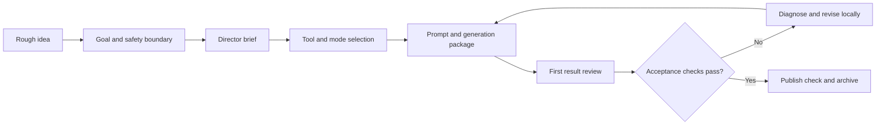

# AI Video Director

**English** | [简体中文](README.zh-CN.md)

A reusable Codex Skill that turns a rough AI-video idea into a tool-adapted production plan, copyable prompt, consistency controls, review criteria, and a focused iteration loop.

> This is an unofficial community project. It is not affiliated with or endorsed by OpenAI, Kling, Dreamina/Jimeng, Gemini, Doubao, CapCut/Jianying, or their operators.

## Why this project exists

AI video creation often fails before generation begins. A short idea may not define the audience, story trigger, character anchors, emotional transition, model mode, timing, or acceptance criteria. The result can be a polished prompt that still produces character drift, disconnected emotion, abrupt endings, or repeated full rewrites.

This Skill turns those creative decisions into a repeatable workflow. It treats the prompt as one production artifact—not the entire production process.

## What it does

- Converts a rough idea into a compact director brief
- Selects text-to-video, image-to-video, smart-storyboard, or custom-storyboard routes
- Defines reusable character and visual anchors
- Produces a copyable, tool-adapted prompt and negative constraints
- Separates visual generation from subtitles, voice, music, sound, and editing
- Diagnoses the first result by shot or time range and changes only the failing part
- Checks rights, platform rules, AI labeling, visual quality, and evidence before publication
- Preserves prompts, references, outputs, and version notes for comparison

## Workflow



## When to use it

- You have an AI-video concept but not a complete production plan.
- You want an original character to remain recognizable across shots.
- You need a prompt for an image-to-video or storyboard workflow.
- A generated clip has face drift, weak emotional continuity, timing problems, or an abrupt ending.
- You need a reviewable AIGC workflow that another creator or team can follow.

## Example invocation

```text
$ai-video-director Turn this character reference and story idea into a 10-second image-to-video plan. Keep the character consistent and define acceptance checks before writing the final prompt.
```

Natural-language invocation also works:

```text
Use the AI Video Director workflow to diagnose this first-generation clip and revise only the failing shots.
```

## Installation

Copy `skills/ai-video-director` into your personal Codex Skills directory:

- Windows: `%USERPROFILE%\.codex\skills\ai-video-director`
- macOS / Linux: `~/.codex/skills/ai-video-director`

Start a new Codex task and invoke `$ai-video-director`.

## Repository structure

```text
.
├── .github/workflows/validate.yml
├── README.md
├── README.zh-CN.md
├── LICENSE
├── SECURITY.md
├── scripts/
│   ├── hash_manifest.py
│   ├── preflight_audit.py
│   └── validate_skill.py
└── skills/ai-video-director/
    ├── SKILL.md
    ├── agents/openai.yaml
    └── references/
        ├── prompt-templates.md
        └── quality-safety-checklist.md
```

## Safety and limitations

- This Skill does not guarantee that a model will generate the intended result in one attempt.
- Confirm rights for faces, voices, characters, brands, music, fonts, and reference media before publication.
- Follow the current AI-content, labeling, watermark, and community rules of the target platform.
- Do not present unreviewed outputs or unsupported performance claims as verified results.
- The workflow supports creative judgment; it does not replace human review for sensitive or high-impact media.

## Project context

The workflow was distilled from repeated practice with original-character image-to-video creation, emotional-performance clips, multi-tool production, and first-result diagnosis. The repository publishes the reusable method without private media, chat logs, platform credentials, or unverified engagement claims.

## License

Released under the [MIT License](LICENSE).
