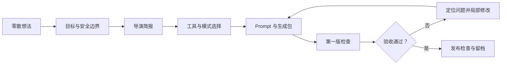

# AI 视频导演式工作流

[English](README.md) | **简体中文**

一个可复用的 Codex Skill：把零散的 AI 视频想法整理成适配目标工具的制作方案、可复制 Prompt、一致性约束、验收标准和局部迭代流程。

> 这是非官方社区项目，与 OpenAI、可灵、即梦、Gemini、豆包、剪映及其运营方不存在隶属或背书关系。

## 为什么做这个项目

AI 视频常常在生成前就已经埋下问题。只有一句创意时，目标观众、故事触发、人物锚点、情绪变化、工具模式、节奏和验收标准都可能没有确定。即使 Prompt 写得很长，也可能出现变脸、情绪断裂、结尾突然截断，或者每次修改都整段重写。

这个 Skill 把这些创作决策整理为一套可以重复使用的工作流。Prompt 是其中一个制作文件，而不是整个制作过程。

## 它能做什么

- 把零散想法补齐为导演简报
- 选择文生视频、图生视频、智能分镜或自定义分镜路线
- 固定人物与视觉锚点
- 输出可复制的工具适配 Prompt 和负面约束
- 将画面生成与字幕、旁白、音乐、音效、剪辑分开处理
- 按镜头或时间定位第一版问题，只修改失败部分
- 发布前检查素材权利、平台规则、AI 标注、画面质量和证据
- 保存参考图、Prompt、成片和版本记录，便于比较与复盘

## 工作流程



## 什么时候使用

- 只有一个 AI 视频想法，还没有完整制作方案。
- 想让原创角色在多个镜头中保持一致。
- 需要编写图生视频或分镜模式的 Prompt。
- 成片出现变脸、情绪不连贯、节奏错误或突然截断。
- 需要一套其他创作者或团队也能执行、检查的 AIGC 工作流。

## 调用示例

```text
$ai-video-director 把这张角色参考图和故事想法整理成 10 秒图生视频方案。先固定人物一致性并写验收标准，再输出最终 Prompt。
```

也可以直接使用自然语言：

```text
使用 AI 视频导演式工作流检查第一版成片，只修改有问题的镜头。
```

## 安装

把 `skills/ai-video-director` 文件夹复制到个人 Codex Skill 目录：

- Windows：`%USERPROFILE%\.codex\skills\ai-video-director`
- macOS / Linux：`~/.codex/skills/ai-video-director`

重新打开 Codex 任务后，调用 `$ai-video-director`。

## 项目结构

```text
.
├── .github/workflows/validate.yml
├── README.md
├── README.zh-CN.md
├── LICENSE
├── SECURITY.md
├── scripts/
│   ├── hash_manifest.py
│   ├── preflight_audit.py
│   └── validate_skill.py
└── skills/ai-video-director/
    ├── SKILL.md
    ├── agents/openai.yaml
    └── references/
        ├── prompt-templates.md
        └── quality-safety-checklist.md
```

## 安全与限制

- 不保证任何模型可以一次生成成功。
- 发布前确认人物肖像、声音、角色、品牌、音乐、字体和参考素材的使用权。
- 遵守目标平台当前的 AI 内容、标注、水印和社区规则。
- 没有检查过的结果或没有证据的数据，不能描述成已经验证。
- 涉及敏感人物或高影响内容时，必须保留人工审核。

## 项目来源

这套流程来自原创角色图生视频、人物情绪表现、多工具协作和第一版成片诊断等真实创作过程。公开仓库只保留可复用方法，不包含私人视频、聊天记录、平台账号或未经验证的互动数据。

## License

本项目采用 [MIT License](LICENSE)。
